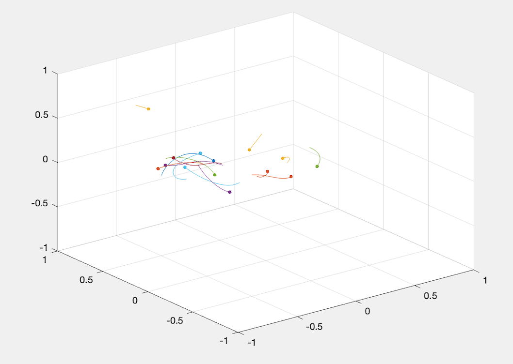

# N-Body Classical Gravitation Simulation

Using Newton’s law of universal gravitation, the acceleration of bodies under mutual gravitational
attraction can be expressed exactly. Then, given a set of initial conditions, finding
the position of bodies under the force of gravity is a second order differential equation. While the
differential equation is simple enough to solve analytically for 2 bodies, it is difficult to solve analytically
for a large number of bodies, so a numerical integrator is used instead. This report presents a
MATLAB implementation of the symplectic ”leapfrog integrator” for simulating the
gravitational attraction between many bodies.

[gravsim.m](gravsim.m) is the "main" script; at the top you can edit the number of bodies, the mass of each body, and the length of each trail. The simulation performs okay up to 100 bodies, but it is not designed to work with many more.

# Reference

 - S. J. Aarseth and F. Hoyle. Dynamical Evolution of Clusters of Galaxies, I. Monthly Notices
of the Royal Astronomical Society, 126(3):223–255, 06 1963.
 - Josh Barnes and Piet Hut. A hierarchical O(N log N) force-calculation algorithm. Nature,
324(6096):446–449, December 1986.
 - Piet Hut, Jun Makino, and Steve McMillan. Building a better leapfrog. The Astrophysical
Journal, 443:L93–L96, 1995.
 - Piet Hut and Michele Trenti. N-body simulations (gravitational) - Scholarpedia
— scholarpedia.org. http://www.scholarpedia.org/article/N-body_simulations_
%28gravitational%29, 2008. [Accessed 05-Dec-2022].
 - Daniel W. Markiewicz. Survey on Symplectic Integrators. https://math.berkeley.edu/
~alanw/242papers99/markiewicz.pdf, 1999. [Online; accessed 06-Dec-2022].
 - MATLAB - MathWorks — mathworks.com. https://www.mathworks.com/products/
matlab.html. [Accessed 06-Dec-2022].
 - MATLAB - MathWorks — mathworks.com. https://www.mathworks.com/help/matlab/
matlab_prog/profiling-for-improving-performance.html. [Accessed 07-Dec-2022].
 - Philip Mocz. Create Your Own N-body Simulation (With Matlab). https://medium.com/
swlh/create-your-own-n-body-simulation-with-matlab-22344954228e, 2020. [On-
line; accessed 06-Dec-2022].
 - https://phys.libretexts.org/Bookshelves/University_Physics/Book%3A_
University_Physics_(OpenStax), title = Book: University Physics (OpenStax), feb
20 2022. [Online; accessed 2022-12-05].
